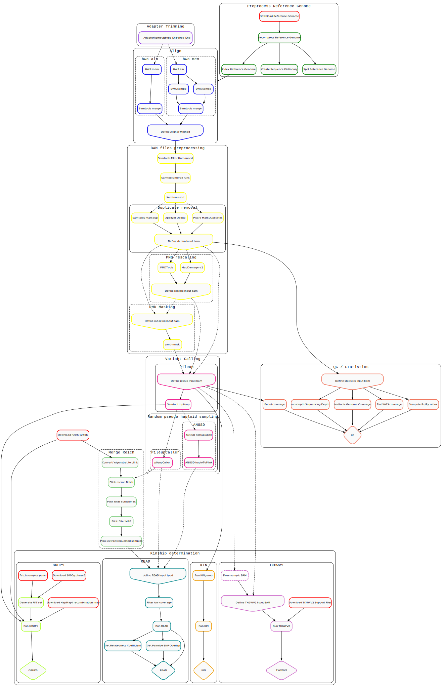

# A basic ancient DNA kinship estimation pipeline

This repository harbors a basic, straightforward and reproducible pipeline for the alignment, pre-processing and analysis of ancient DNA whole-genome sequencing data from human samples, with a strong focus on kinship estimation.

This pipeline is built upon the [Snakemake](https://snakemake.readthedocs.io/en/stable/) workflow management system, and pre-processes samples from raw `FASTQ` files, to analysis-ready random pseudo-haploid variant calls (in [`EIGENSTRAT`](https://reich.hms.harvard.edu/software/InputFileFormats) format). The pipeline can additionally:

- Apply kinship estimation using [`GRUPS-rs`](https://doi.org/10.47248/hpgg2404010001), [`READ`](https://doi.org/10.1371/journal.pone.0195491), [`KIN`](https://doi.org/10.1186/s13059-023-02847-7) and/or [`TKGWV2`](https://www.nature.com/articles/s41598-021-00581-3)
- Apply genetic sex-determination, using Rx and Ry ratios (see: [(Mittnick et al 2016)](https://doi.org/10.1371/journal.pone.0163019), [(Skoglund et al 2013)](https://doi.org/10.1016/j.jas.2013.07.004)).
- Provide with a set of very basic quality checks and summary statistics, such a genome coverage and average sequencing depth

## Workflow overview (Simplified Rulegraph)

<p align="center">
  
  <br>
  <caption>
      <em>Figure 1.</em> A simplified directed acyclic graph of the pipeline processing and analysis pathway(s). Dashed lines are represent optional/alternative pathways. 
  </caption>
</p>

## Installation

01. Clone this repository

  ```Bash
user@desktop:~$ git clone --recursive git@github.com:MaelLefeuvre/aDNA-pipeline.git
  ```

02. Install [Conda](https://docs.conda.io/en/latest/)

  - Check the documentation of [miniconda3](https://docs.conda.io/en/latest/miniconda.html) and review the detailled [installation instructions](https://docs.conda.io/projects/conda/en/latest/user-guide/install/index.html) beforehand.

  - On a x86_64 bits Linux architecture:

    ```Bash
    MINICONDA_URL="https://repo.anaconda.com/miniconda/Miniconda3-latest-Linux-x86_64.sh"
    wget $MINICONDA_URL && bash Miniconda3-latest-Linux-x86_64.sh
    ```

03. [Optional] Install [Mamba](https://github.com/mamba-org/mamba)

  - Integrates seamlessly with conda, and greatly speeds-up the environment solver.

  - On a x86_64 bit Linux architecture:

    ```Bash
    conda install -n base -c conda-forge mamba
    ```

04. Install [Snakemake](https://snakemake.github.io/)

  - Check the [documentation](https://snakemake.readthedocs.io/en/stable/) and review the detailled [installation instructions](https://snakemake.readthedocs.io/en/stable/getting_started/installation.html)

  - A dedicated environment is available within this repository. On an `x86_64` bit Linux architecture:

    ```bash
    mamba env install -f ./workflow/envs/snakemake-7.20.0.yml
    ```

## Usage

### Input samples preparation 

#### 1. Place your raw FASTQ files in the `original-data/samples` directory.

This pipeline currently supports both paired-end and single-end sequencing protocols, as well as the joint processing of multiple sequencing runs for a given sample.

  - For paired-end data, filenames and directory structure must **strictly** follow the current nomenclature: 
    `original-data/samples/{sample-name}/{run-id}/{sample-name}_R{1,2}.fastq.gz`
  - For single-end data, filenames and directory structure must **strictly** follow the current nomenclature:
    `original-data/samples/{sample-name}/{run-id}/{sample-name}_R1.fastq.gz`

  
**Example**:
```Bash
original-data
└── samples
    ├── test-ind1
    │   ├── run-00
    │   │   ├── test-ind1_R1.fastq.gz
    │   │   └── test-ind1_R2.fastq.gz
    │   └── run-01
    │       ├── test-ind1_R1.fastq.gz
    │       └── test-ind1_R2.fastq.gz
    ├── MT26
    │   ├── run-00
    │   │   ├── test-ind2_R1.fastq.gz
    │   │   └── test-ind2_R2.fastq.gz
    │   └── run-01
    │       ├── test-ind2_R1.fastq.gz
    │       └── test-ind2_R2.fastq.gz
    └── test-ind3
        └──  run00
            └── test-ind3_R1.fastq.gz
```

#### 2. Specify the targeted sample and protocol into the `config/samples.yml` configuration file

This configuration file explicitely defines which sequencing runs and samples should be processed by the pipeline. Note that:

1. sequencing runs for a given sample are aligned separately, and merged right after the alignment step.
2. single-end and paired-end sequencing runs can be mixed and matched together

**Example**:

```
samples:
  test-ind1:
    run-00: {protocol: 'paired'}
    run-01: {protocol: 'paired'}
  test-ind2:
    run-00: {protocol: 'paired'}
    run-01: {protocol: 'paired'}
  test-ind3:
    run-00: {protocol: 'single'}
```

### (Optional) Configuring the pipeline

Pipeline parameters and behaviour may be configured by modifying the [`config/config.yml`](/config/config.yml) configuration file. A short description of every parameter may be found within the aformentioned file. The provided defaults are applicable for most intents and purposes, and strongly adheres to best-practices described in [(Gunther et a l 2019)](https://doi.org/10.1371/journal.pgen.1008302) and [(Oliva et al 2021)](https://doi.org/10.1093/bib/bbab076)

### Running the pipeline

#### Preamble

Activate the provided `snakemake-7.20.0` conda environment:
```Bash
mamba activate snakemake-7.20.0.yml
```

Executing the pipeline is then applied by directly using Snakemake's syntax, e.g.

```bash
snakemake [target rule(s), ...] --use-conda --cores <N-cores> (other-optional-arguments ...)
```

For complete beginners, a list of all available snakemake arguments may be found by executing `snakemake --help`. Detailled information may be found in the official Snakemake documentation [here](https://snakemake.readthedocs.io/en/stable/executing/cli.html)


#### Target rules

Several target rules are currently available:

- `fetch_data`: Downloads and preprocesses all of the files and datasets required by the pipeline (e.g.: reference genomes, target SNP datasets, recombination maps, etc.).
- `preprocess`: Align and preprocess the provided raw `FASTQ` input files into a set of analysis-ready bam files
- `pileup`: Applies basic random pseudo-haploid variant calling using [`samtools`](http://www.htslib.org/doc/samtools-mpileup.html) and [`pileupCaller`](https://github.com/stschiff/sequenceTools) software, and the [AADR 1240K`](https://doi.org/10.7910/DVN/FFIDCW) SNP dataset.
- `qc`: Applies basic QC and sex-determination.
- `GRUPS`: Applies pairwise kinship estimation on every pair of individuals, using [grups-rs](https://github.com/MaelLefeuvre/grups-rs).
- `READ`: Applies joint kinship estimation, using [READ](https://bitbucket.org/tguenther/read)
- `KIN`: Applies joint kinship estimation of the samples, using [KIN](https://github.com/DivyaratanPopli/Kinship_Inference)
- `TKGWV2`: Applies pairwise kinship estimation on every pair of individuals, using [TKGWV2](https://github.com/danimfernandes/tkgwv2)
- `all` (default): Applies all of the above.

#### Examples Run the pipeline (using all cores + 64GB of RAM).

###### 1. Generate analysis-ready bam files, as well as basic QC, using 32 cores and all of the available memory
```Bash
snakemake preprocess qc --use-conda --conda-frontend mamba --cores 32
```

###### 2. Run the whole pipeline using all available cores and `80GB` or memory
```Bash
snakemake --use-conda --conda-frontend mamba --cores `proc` --resources mem_mb=80000 --printshellcmds --rerun-incomplete 
```

### Output

Once completed, the pipeline will have generated two main directories:

The `data` directory will strictly contain data that is downloaded and/or generated from publicly available databases. i.e: reference genome(s), AADR 1240K Compendium dataset, recombination maps, 1000g-phase3 dataset, etc. 

The `results` directory will contain output data that is directly related to, or generated from the provided raw input `FASTQ` files. i.e.: analysis-ready bam files, QC plots and summary statistics, variant callsets (in EIGENSTRAT format), kinship analysis results, etc. Note that subdirectories are 'chaptered' and numbered according to their place within the workflow. e.g. `results/01-preprocess` will contain binary alignment files for every sample ; `results/03-kinship` will contain the results of every invoked kinship estimation method, etc.


